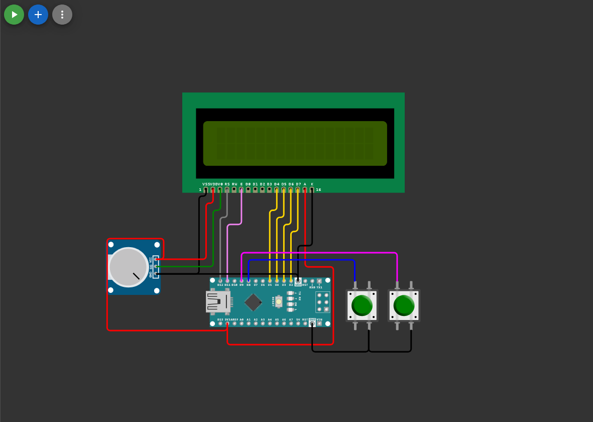

# Arduino Dino

A Chrome Dino clone for Arduino (ATmega328P) with a 16x2 LCD display. Written in C with an assembly component.

## Wiring Diagram



| LCD | Arduino |
|-----|---------|
| RS  | 12 (PB4) |
| E   | 11 (PB3) |
| D4  | 5  (PD5) |
| D5  | 4  (PD4) |
| D6  | 3  (PD3) |
| D7  | 2  (PD2) |

| Button | Arduino |
|--------|---------|
| ENTER  | 8  (PB0) |
| SELECT | 9  (PB1) |

Buttons use internal pull-ups (active LOW).

## Building

Requires `avr-gcc` and `avr-libc`.

```bash
make
```

To flash (adjust COM port):

```bash
make flash
```

## Project Structure

| File | Purpose |
|------|---------|
| `main.c` | Entry point, menu, score display |
| `game.c` / `game.h` | Game logic (jump, trees, collision, name entry) |
| `display.c` / `display.h` | HD44780 LCD driver (4-bit, direct port I/O) |
| `dino.S` | Assembly: dino/tree bitmaps, `delay_ms()` |
| `delay.h` | Header for the assembly `delay_ms()` |
| `Makefile` | avr-gcc build for ATmega328P @ 16MHz |

## How to Play

- Press **ENTER** to jump the dino over cacti
- Press **SELECT** to navigate menus
- Enter a 3-letter name on game over
- Score increases per frame survived; jumping penalizes score
