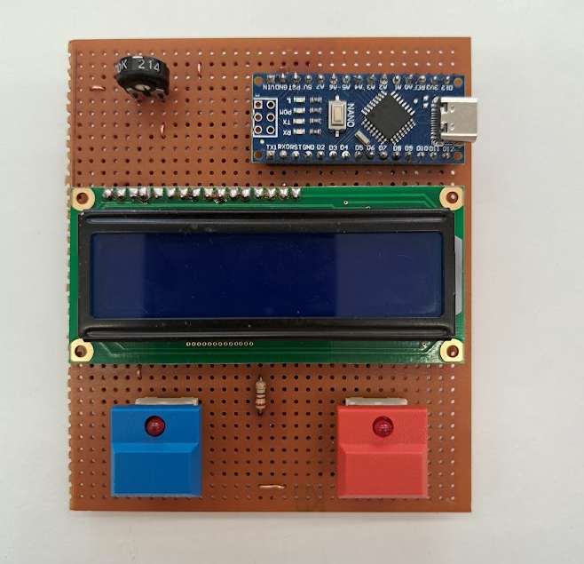
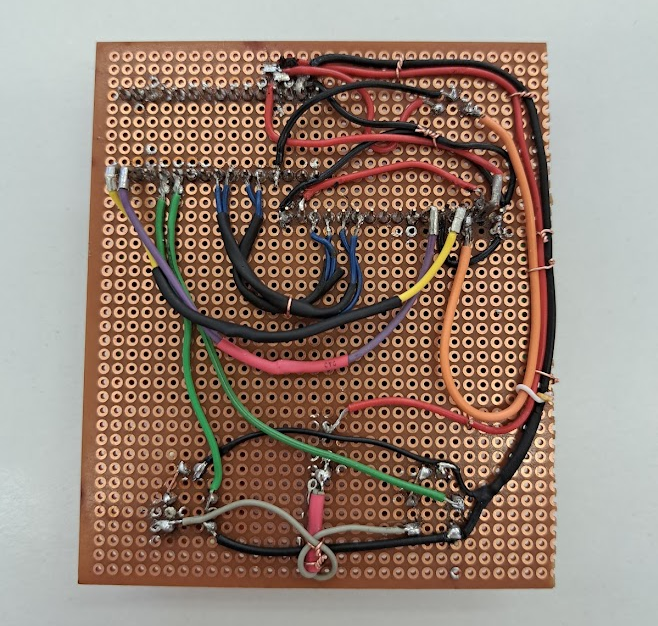
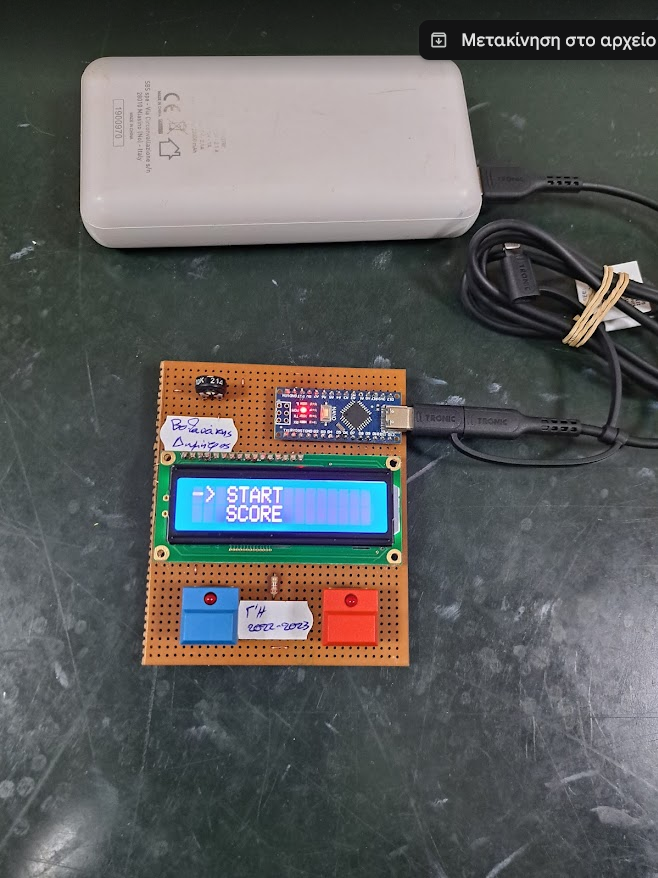
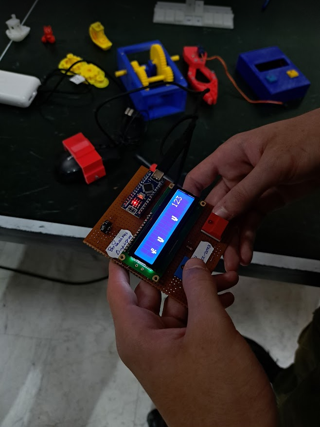
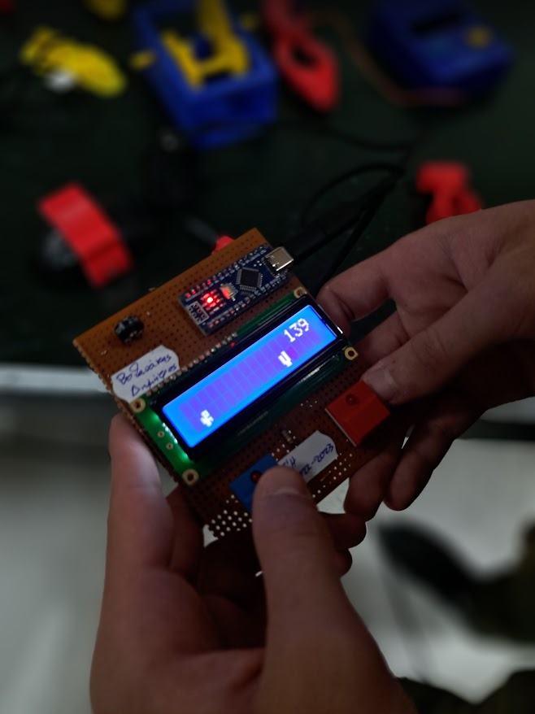

# Arduino Dino

A Chrome Dino clone for **ATmega328P** with a **16x2 LCD display**. Written in C with an assembly component.

---

## Background

I built this back in 2023 during my final year of high school, right after participating in the **European 3D design and entrepreneurship program (3D2ACT)** in Cyprus. 

Instead of just treating the program as a nice trip, I wanted to prove to our school administration and the **Regional Directorate of Education of Crete** that we actually brought back real, practical skills. To show that the funding went into genuine engineering development rather than just a vacation, I built this system upon our return and presented it to them as tangible proof of what we learned.

---

## Table of Contents

- [Background](#background)
- [Features](#features)
- [Gallery](#gallery)
- [Wiring Diagram](#wiring-diagram)
- [How to Play](#how-to-play)
- [Building](#building)
- [Project Structure](#project-structure)

---

## Features

- Dino character that jumps over scrolling cacti
- Procedurally generated tree spacing
- Score tracking with airborne penalty
- Persistent high scores with 3-letter name entry
- LCD custom character bitmaps (assembly)

---

## Gallery

| Front View | Back View | Menu Screen |
|:----------:|:---------:|:-----------:|
|  |  |  |

| Game Running | Game Running |
|:------------:|:------------:|
|  |  |

---

## Wiring Diagram


### LCD to Arduino

| LCD Pin | Arduino Pin |
|---------|-------------|
| RS      | 12 (PB4)    |
| E       | 11 (PB3)    |
| D4      | 5  (PD5)    |
| D5      | 4  (PD4)    |
| D6      | 3  (PD3)    |
| D7      | 2  (PD2)    |

### Buttons to Arduino

| Button | Arduino Pin |
|--------|-------------|
| ENTER  | 8  (PB0)    |
| SELECT | 9  (PB1)    |

> Buttons use internal pull-ups (active LOW).

---

## How to Play

| Action | Button |
|--------|--------|
| Jump the dino over cacti | **ENTER** (PB0) |
| Navigate menus | **SELECT** (PB1) |

- Enter a **3-letter name** when the game ends
- Score increases each frame survived
- Jumping too long penalizes your score (-3 per frame after 3 frames)

---

## Building

Requires `avr-gcc` and `avr-libc`.

```bash
make
```

To flash (adjust COM port as needed):

```bash
make flash
```

---

## Project Structure

| File | Purpose |
|------|---------|
| `main.c` | Entry point, menu, score display |
| `game.c` / `game.h` | Game logic (jump, trees, collision, name entry) |
| `display.c` / `display.h` | HD44780 LCD driver (4-bit, direct port I/O) |
| `dino.S` | Assembly bitmaps for dino/tree + `delay_ms()` |
| `delay.h` | Header for assembly `delay_ms()` |
| `Makefile` | avr-gcc build for ATmega328P @ 16 MHz |
